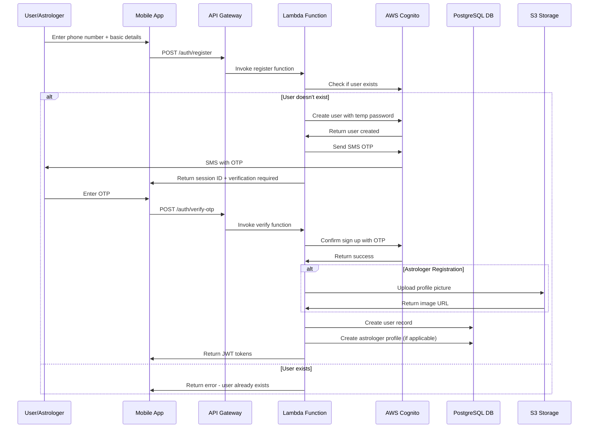
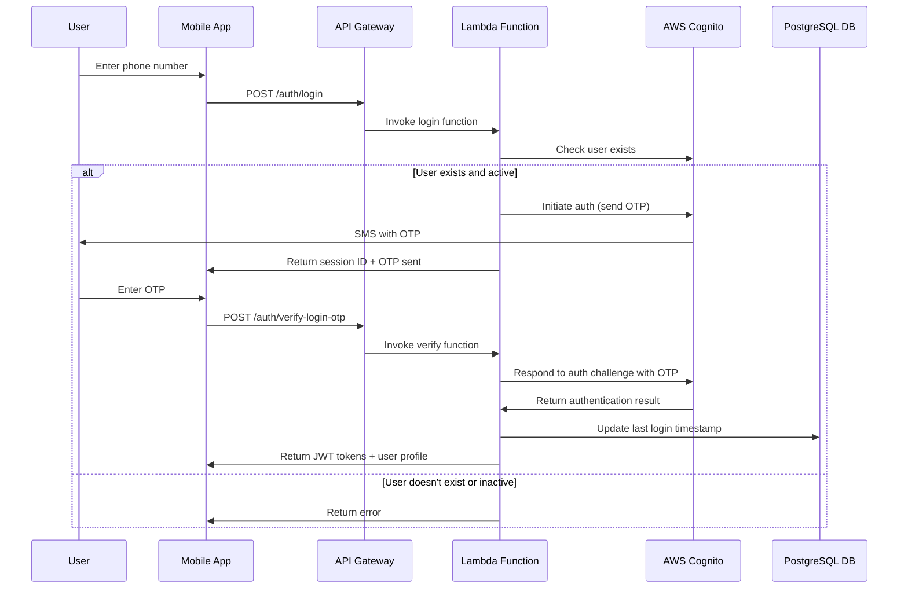
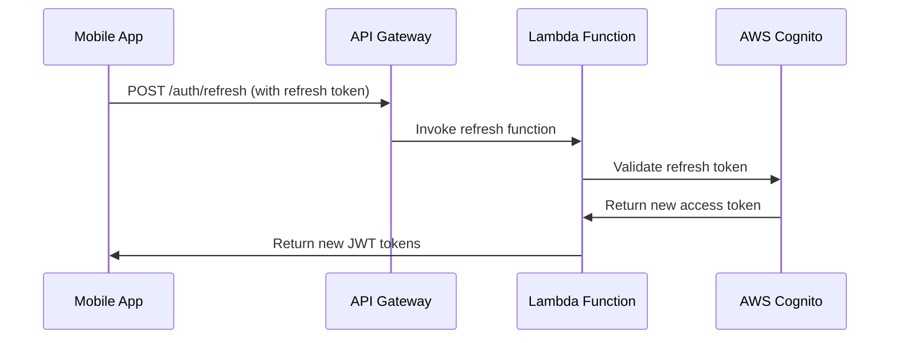

# Mobile OTP Authentication Flow

## Overview
This document outlines the mobile OTP-based authentication flow using AWS Cognito for both users and astrologers in the AstroTalk system.

## Authentication Flow Diagrams

### 1. User Registration Flow



### 2. Login Flow



### 3. Token Refresh Flow



## Detailed Implementation

### 1. AWS Cognito Configuration

#### User Pool Settings
```json
{
  "UserPool": {
    "Policies": {
      "PasswordPolicy": {
        "MinimumLength": 8,
        "RequireUppercase": false,
        "RequireLowercase": false,
        "RequireNumbers": false,
        "RequireSymbols": false
      }
    },
    "UsernameAttributes": ["phone_number"],
    "MfaConfiguration": "OPTIONAL",
    "SmsConfiguration": {
      "ExternalId": "astrotalk-sms",
      "SnsCallerArn": "arn:aws:iam::ACCOUNT:role/service-role/sns-sms-role"
    },
    "Schema": [
      {
        "Name": "phone_number",
        "AttributeDataType": "String",
        "Required": true,
        "Mutable": true
      },
      {
        "Name": "email",
        "AttributeDataType": "String",
        "Required": false,
        "Mutable": true
      },
      {
        "Name": "user_type",
        "AttributeDataType": "String",
        "Required": true,
        "Mutable": false
      },
      {
        "Name": "profile_status",
        "AttributeDataType": "String",
        "Required": false,
        "Mutable": true
      },
      {
        "Name": "city",
        "AttributeDataType": "String",
        "Required": false,
        "Mutable": true
      }
    ]
  }
}
```

### 2. Lambda Function Implementations

#### Registration Function (Node.js)
```javascript
const AWS = require('aws-sdk');
const cognito = new AWS.CognitoIdentityServiceProvider();
const { Pool } = require('pg');

exports.handler = async (event) => {
    try {
        const { phone_number, user_type, first_name, last_name, city, email } = JSON.parse(event.body);
        
        // Validate input
        if (!phone_number || !user_type || !first_name) {
            return {
                statusCode: 400,
                body: JSON.stringify({ error: 'Missing required fields' })
            };
        }
        
        // Check if user already exists
        try {
            await cognito.adminGetUser({
                UserPoolId: process.env.USER_POOL_ID,
                Username: phone_number
            }).promise();
            
            return {
                statusCode: 409,
                body: JSON.stringify({ error: 'User already exists' })
            };
        } catch (err) {
            if (err.code !== 'UserNotFoundException') {
                throw err;
            }
        }
        
        // Create user in Cognito
        const createUserParams = {
            UserPoolId: process.env.USER_POOL_ID,
            Username: phone_number,
            UserAttributes: [
                { Name: 'phone_number', Value: phone_number },
                { Name: 'custom:user_type', Value: user_type },
                { Name: 'custom:profile_status', Value: 'pending' },
                { Name: 'given_name', Value: first_name },
                { Name: 'family_name', Value: last_name }
            ],
            TemporaryPassword: generateTempPassword(),
            MessageAction: 'SUPPRESS' // Don't send welcome email
        };
        
        if (email) {
            createUserParams.UserAttributes.push({ Name: 'email', Value: email });
        }
        
        if (city) {
            createUserParams.UserAttributes.push({ Name: 'custom:city', Value: city });
        }
        
        const createResult = await cognito.adminCreateUser(createUserParams).promise();
        
        // Set permanent password (same as temp password)
        await cognito.adminSetUserPassword({
            UserPoolId: process.env.USER_POOL_ID,
            Username: phone_number,
            Password: createUserParams.TemporaryPassword,
            Permanent: true
        }).promise();
        
        // Initiate SMS OTP
        const authResult = await cognito.adminInitiateAuth({
            UserPoolId: process.env.USER_POOL_ID,
            ClientId: process.env.CLIENT_ID,
            AuthFlow: 'ADMIN_NO_SRP_AUTH',
            AuthParameters: {
                USERNAME: phone_number,
                PASSWORD: createUserParams.TemporaryPassword
            }
        }).promise();
        
        return {
            statusCode: 200,
            body: JSON.stringify({
                message: 'OTP sent successfully',
                session: authResult.Session,
                challengeName: authResult.ChallengeName
            })
        };
        
    } catch (error) {
        console.error('Registration error:', error);
        return {
            statusCode: 500,
            body: JSON.stringify({ error: 'Internal server error' })
        };
    }
};

function generateTempPassword() {
    return Math.random().toString(36).slice(-12) + 'A1!';
}
```

#### OTP Verification Function
```javascript
exports.verifyOTP = async (event) => {
    try {
        const { session, otp_code, user_data } = JSON.parse(event.body);
        
        // Verify OTP with Cognito
        const verifyResult = await cognito.adminRespondToAuthChallenge({
            UserPoolId: process.env.USER_POOL_ID,
            ClientId: process.env.CLIENT_ID,
            ChallengeName: 'SMS_MFA',
            Session: session,
            ChallengeResponses: {
                SMS_MFA_CODE: otp_code,
                USERNAME: user_data.phone_number
            }
        }).promise();
        
        if (verifyResult.AuthenticationResult) {
            // Create user record in PostgreSQL
            const dbResult = await createUserInDatabase(user_data, verifyResult);
            
            return {
                statusCode: 200,
                body: JSON.stringify({
                    message: 'Registration successful',
                    access_token: verifyResult.AuthenticationResult.AccessToken,
                    refresh_token: verifyResult.AuthenticationResult.RefreshToken,
                    id_token: verifyResult.AuthenticationResult.IdToken,
                    user: dbResult
                })
            };
        }
        
    } catch (error) {
        console.error('OTP verification error:', error);
        return {
            statusCode: 400,
            body: JSON.stringify({ error: 'Invalid OTP' })
        };
    }
};

async function createUserInDatabase(userData, cognitoResult) {
    const pool = new Pool({
        connectionString: process.env.DATABASE_URL
    });
    
    const client = await pool.connect();
    
    try {
        await client.query('BEGIN');
        
        // Insert user
        const userResult = await client.query(`
            INSERT INTO users (
                cognito_user_id, phone_number, email, user_type, 
                first_name, last_name, city, is_phone_verified
            ) VALUES ($1, $2, $3, $4, $5, $6, $7, $8)
            RETURNING *
        `, [
            cognitoResult.Username,
            userData.phone_number,
            userData.email,
            userData.user_type,
            userData.first_name,
            userData.last_name,
            userData.city,
            true
        ]);
        
        const user = userResult.rows[0];
        
        // If astrologer, create astrologer profile
        if (userData.user_type === 'astrologer') {
            await client.query(`
                INSERT INTO astrologer_profiles (
                    user_id, display_name, bio, languages, specializations
                ) VALUES ($1, $2, $3, $4, $5)
            `, [
                user.id,
                `${userData.first_name} ${userData.last_name}`,
                userData.bio || '',
                userData.languages || ['Hindi', 'English'],
                userData.specializations || ['Vedic Astrology']
            ]);
            
            // Create wallet
            await client.query(`
                INSERT INTO user_wallets (user_id) VALUES ($1)
            `, [user.id]);
        }
        
        await client.query('COMMIT');
        return user;
        
    } catch (error) {
        await client.query('ROLLBACK');
        throw error;
    } finally {
        client.release();
    }
}
```

### 3. Security Measures

#### Rate Limiting
- Maximum 3 OTP requests per phone number per 15 minutes
- Maximum 5 failed OTP attempts per session
- Account lockout after 10 failed login attempts in 24 hours

#### OTP Configuration
- 6-digit numeric OTP
- Valid for 10 minutes
- Single use only
- Cannot be reused

#### Token Security
- Access tokens: 1 hour expiry
- Refresh tokens: 30 days expiry
- Secure HTTP-only cookies for web
- Encrypted storage for mobile apps

### 4. Error Handling

#### Common Error Responses
```json
{
  "400": {
    "INVALID_PHONE_NUMBER": "Phone number format is invalid",
    "INVALID_OTP": "OTP is invalid or expired",
    "MISSING_REQUIRED_FIELDS": "Required fields are missing"
  },
  "409": {
    "USER_ALREADY_EXISTS": "User with this phone number already exists"
  },
  "429": {
    "RATE_LIMITED": "Too many requests. Please try again later"
  },
  "500": {
    "INTERNAL_ERROR": "Internal server error"
  }
}
```

### 5. Testing Scenarios

#### Registration Testing
1. Valid phone number registration
2. Duplicate phone number registration
3. Invalid phone number format
4. Missing required fields
5. OTP verification success/failure
6. Session timeout handling

#### Login Testing
1. Existing user login
2. Non-existent user login
3. Suspended user login
4. Rate limiting scenarios
5. Token refresh scenarios

### 6. Monitoring and Analytics

#### CloudWatch Metrics
- Registration success/failure rates
- OTP delivery success rates
- Login success/failure rates
- API response times
- Error rates by endpoint

#### Custom Metrics
- User registration funnel
- OTP verification completion rates
- Failed authentication attempts
- Geographic distribution of users
