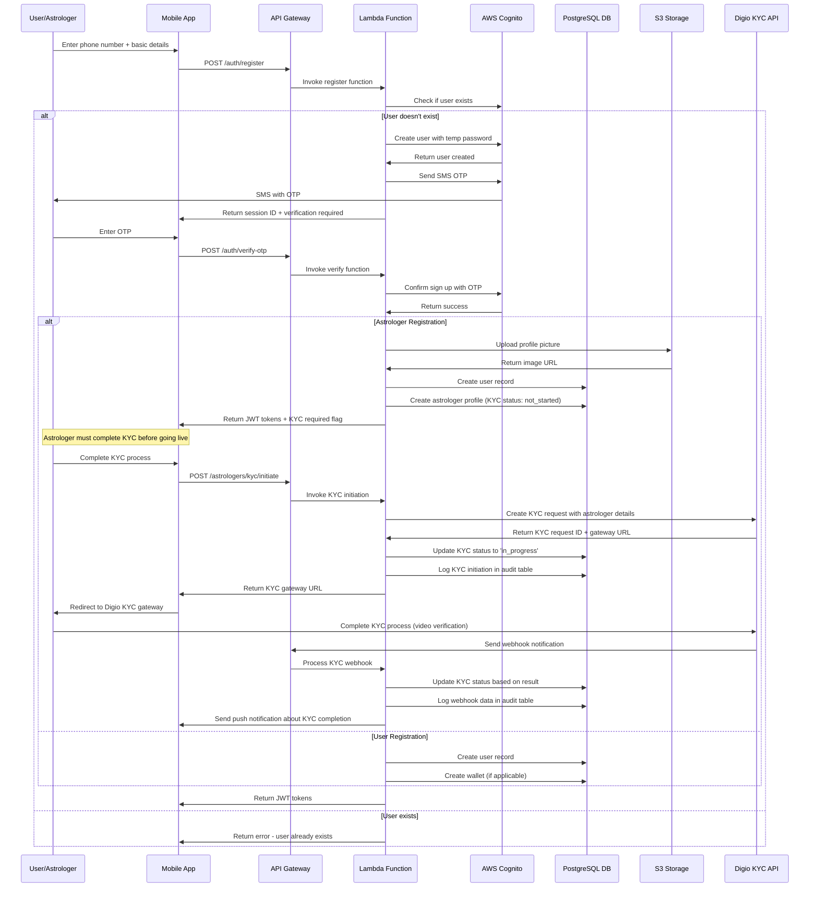
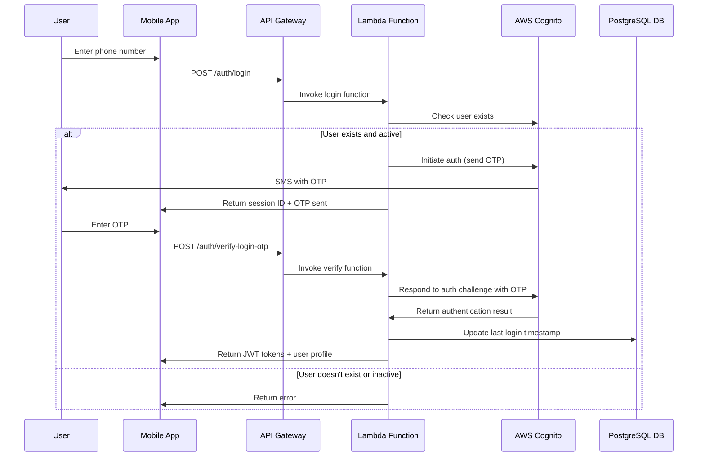
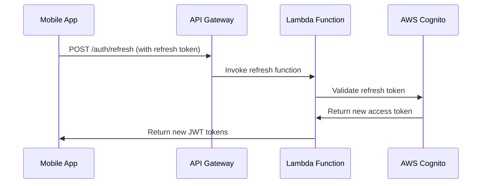
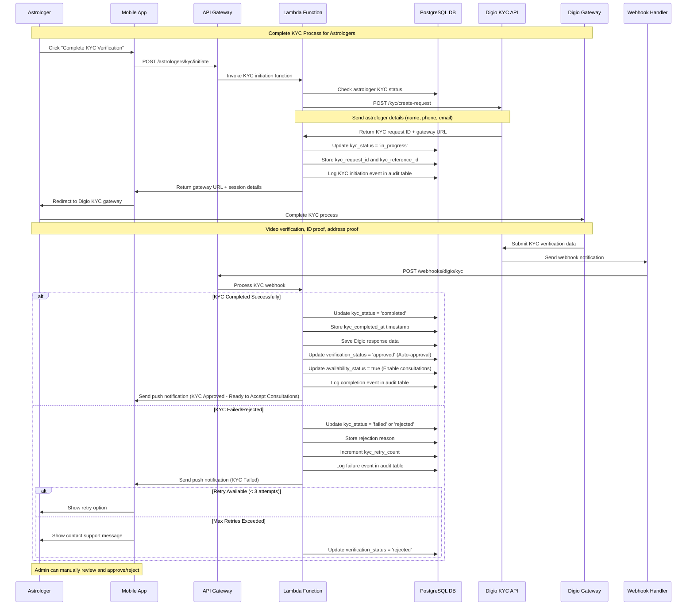
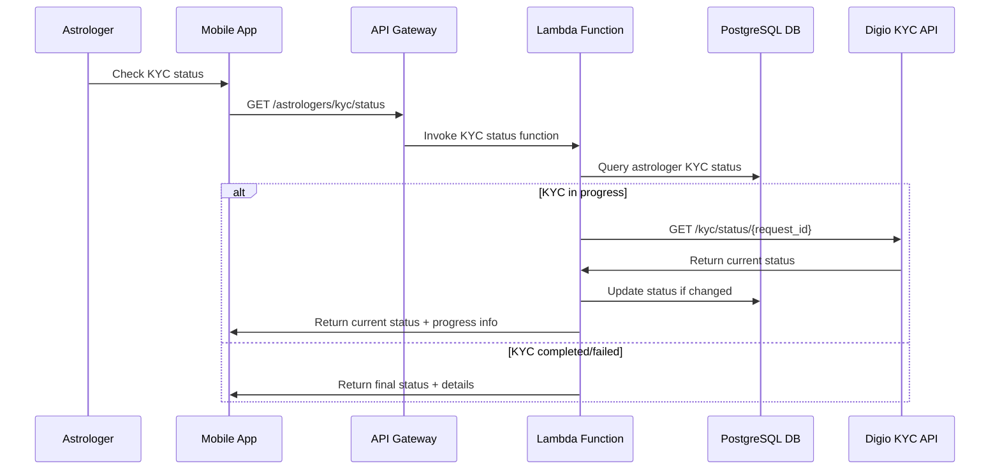

# Mobile OTP Authentication Flow

## Overview
This document outlines the mobile OTP-based authentication flow using AWS Cognito for both users and astrologers in the AstroTalk system.

## Authentication Flow Diagrams

### 1. User Registration Flow



### 2. Login Flow



### 3. Token Refresh Flow



### 4. Astrologer KYC Verification Flow



### 5. KYC Status Check Flow



## Detailed Implementation

### 1. AWS Cognito Configuration

#### User Pool Settings
```json
{
  "UserPool": {
    "Policies": {
      "PasswordPolicy": {
        "MinimumLength": 8,
        "RequireUppercase": false,
        "RequireLowercase": false,
        "RequireNumbers": false,
        "RequireSymbols": false
      }
    },
    "UsernameAttributes": ["phone_number"],
    "MfaConfiguration": "OPTIONAL",
    "SmsConfiguration": {
      "ExternalId": "astrotalk-sms",
      "SnsCallerArn": "arn:aws:iam::ACCOUNT:role/service-role/sns-sms-role"
    },
    "Schema": [
      {
        "Name": "phone_number",
        "AttributeDataType": "String",
        "Required": true,
        "Mutable": true
      },
      {
        "Name": "email",
        "AttributeDataType": "String",
        "Required": false,
        "Mutable": true
      },
      {
        "Name": "user_type",
        "AttributeDataType": "String",
        "Required": true,
        "Mutable": false
      },
      {
        "Name": "profile_status",
        "AttributeDataType": "String",
        "Required": false,
        "Mutable": true
      },
      {
        "Name": "city",
        "AttributeDataType": "String",
        "Required": false,
        "Mutable": true
      }
    ]
  }
}
```

### 2. Digio KYC Integration Configuration

#### Digio API Configuration
```javascript
const DIGIO_CONFIG = {
    SANDBOX: {
        BASE_URL: 'https://ext.digio.in:444',
        CLIENT_ID: process.env.DIGIO_SANDBOX_CLIENT_ID,
        CLIENT_SECRET: process.env.DIGIO_SANDBOX_CLIENT_SECRET
    },
    PRODUCTION: {
        BASE_URL: 'https://api.digio.in',
        CLIENT_ID: process.env.DIGIO_PROD_CLIENT_ID,
        CLIENT_SECRET: process.env.DIGIO_PROD_CLIENT_SECRET
    }
};

// KYC Request Configuration
const KYC_REQUEST_CONFIG = {
    kyc_type: 'video_kyc',
    callback_url: `${process.env.API_BASE_URL}/webhooks/digio/kyc`,
    redirect_url: `${process.env.FRONTEND_URL}/astrologer/kyc/callback`,
    purpose: 'astrologer_verification',
    expire_in_days: 7,
    send_sms: true
};
```

#### KYC Webhook Signature Verification
```javascript
const crypto = require('crypto');

function verifyDigioWebhook(payload, signature, secret) {
    const expectedSignature = crypto
        .createHmac('sha256', secret)
        .update(payload)
        .digest('hex');
    
    return crypto.timingSafeEqual(
        Buffer.from(signature),
        Buffer.from(expectedSignature)
    );
}
```

### 3. Lambda Function Implementations

#### KYC Initiation Function (Node.js)
```javascript
const AWS = require('aws-sdk');
const axios = require('axios');
const { Pool } = require('pg');

exports.initiateKYC = async (event) => {
    try {
        const { astrologer_id } = JSON.parse(event.body);
        const userId = event.requestContext.authorizer.sub; // From JWT
        
        const pool = new Pool({
            connectionString: process.env.DATABASE_URL
        });
        
        // Get astrologer details
        const astrologerQuery = `
            SELECT ap.*, u.first_name, u.last_name, u.phone_number, u.email
            FROM astrologer_profiles ap
            JOIN users u ON ap.user_id = u.id
            WHERE ap.id = $1 AND u.cognito_user_id = $2
        `;
        
        const astrologerResult = await pool.query(astrologerQuery, [astrologer_id, userId]);
        
        if (astrologerResult.rows.length === 0) {
            return {
                statusCode: 404,
                body: JSON.stringify({ error: 'Astrologer profile not found' })
            };
        }
        
        const astrologer = astrologerResult.rows[0];
        
        // Check if KYC already completed
        if (astrologer.kyc_status === 'completed') {
            return {
                statusCode: 400,
                body: JSON.stringify({ error: 'KYC already completed' })
            };
        }
        
        // Check retry limit
        if (astrologer.kyc_retry_count >= 3) {
            return {
                statusCode: 400,
                body: JSON.stringify({ error: 'Maximum KYC retry attempts exceeded' })
            };
        }
        
        // Generate internal reference ID
        const kycReferenceId = `KYC_${astrologer.id}_${Date.now()}`;
        
        // Prepare Digio KYC request
        const digioPayload = {
            identifier: astrologer.phone_number,
            name: `${astrologer.first_name} ${astrologer.last_name}`,
            email: astrologer.email,
            phone: astrologer.phone_number,
            reference_id: kycReferenceId,
            ...KYC_REQUEST_CONFIG
        };
        
        // Create KYC request with Digio
        const digioResponse = await axios.post(
            `${DIGIO_CONFIG.PRODUCTION.BASE_URL}/v2/client/kyc/create_request`,
            digioPayload,
            {
                headers: {
                    'Authorization': `Bearer ${await getDigioAccessToken()}`,
                    'Content-Type': 'application/json'
                }
            }
        );
        
        const kycRequestId = digioResponse.data.id;
        const gatewayUrl = digioResponse.data.access_token.url;
        
        // Update database
        const updateQuery = `
            UPDATE astrologer_profiles 
            SET 
                kyc_status = 'in_progress',
                kyc_request_id = $1,
                kyc_reference_id = $2,
                kyc_initiated_at = CURRENT_TIMESTAMP,
                updated_at = CURRENT_TIMESTAMP
            WHERE id = $3
        `;
        
        await pool.query(updateQuery, [kycRequestId, kycReferenceId, astrologer_id]);
        
        // Log KYC initiation
        await logKYCAuditEvent(astrologer_id, kycRequestId, 'initiated', 'success', {
            api_request: digioPayload,
            api_response: digioResponse.data
        });
        
        return {
            statusCode: 200,
            body: JSON.stringify({
                success: true,
                message: 'KYC process initiated successfully',
                data: {
                    kyc_request_id: kycRequestId,
                    kyc_reference_id: kycReferenceId,
                    gateway_url: gatewayUrl,
                    expires_in: '7 days'
                }
            })
        };
        
    } catch (error) {
        console.error('KYC initiation error:', error);
        
        // Log failure
        if (astrologer_id && kycRequestId) {
            await logKYCAuditEvent(astrologer_id, kycRequestId, 'initiated', 'failure', {
                error_message: error.message,
                stack_trace: error.stack
            });
        }
        
        return {
            statusCode: 500,
            body: JSON.stringify({ error: 'Failed to initiate KYC process' })
        };
    }
};

async function getDigioAccessToken() {
    // Implement Digio OAuth token retrieval
    const tokenResponse = await axios.post(
        `${DIGIO_CONFIG.PRODUCTION.BASE_URL}/oauth/token`,
        {
            client_id: DIGIO_CONFIG.PRODUCTION.CLIENT_ID,
            client_secret: DIGIO_CONFIG.PRODUCTION.CLIENT_SECRET,
            grant_type: 'client_credentials'
        }
    );
    
    return tokenResponse.data.access_token;
}

async function logKYCAuditEvent(astrologerProfileId, kycRequestId, eventType, eventStatus, eventData) {
    const pool = new Pool({
        connectionString: process.env.DATABASE_URL
    });
    
    await pool.query(`
        INSERT INTO kyc_audit_logs (
            astrologer_profile_id, kyc_request_id, event_type, event_status,
            api_request_data, api_response_data, error_message
        ) VALUES ($1, $2, $3, $4, $5, $6, $7)
    `, [
        astrologerProfileId,
        kycRequestId,
        eventType,
        eventStatus,
        eventData.api_request || null,
        eventData.api_response || null,
        eventData.error_message || null
    ]);
}
```

#### KYC Webhook Handler Function
```javascript
exports.handleKYCWebhook = async (event) => {
    try {
        const signature = event.headers['x-digio-signature'];
        const payload = event.body;
        
        // Verify webhook signature
        if (!verifyDigioWebhook(payload, signature, process.env.DIGIO_WEBHOOK_SECRET)) {
            return {
                statusCode: 401,
                body: JSON.stringify({ error: 'Invalid webhook signature' })
            };
        }
        
        const webhookData = JSON.parse(payload);
        const { reference_id, status, kyc_details } = webhookData;
        
        const pool = new Pool({
            connectionString: process.env.DATABASE_URL
        });
        
        // Find astrologer by reference ID
        const astrologerQuery = `
            SELECT id, user_id FROM astrologer_profiles 
            WHERE kyc_reference_id = $1
        `;
        
        const astrologerResult = await pool.query(astrologerQuery, [reference_id]);
        
        if (astrologerResult.rows.length === 0) {
            console.error('Astrologer not found for reference ID:', reference_id);
            return {
                statusCode: 404,
                body: JSON.stringify({ error: 'Astrologer not found' })
            };
        }
        
        const astrologer = astrologerResult.rows[0];
        
        // Process KYC status
        let kycStatus, verificationStatus, rejectionReason = null;
        
        switch (status.toLowerCase()) {
            case 'completed':
            case 'success':
                kycStatus = 'completed';
                verificationStatus = 'approved';
                break;
            case 'failed':
            case 'rejected':
                kycStatus = 'failed';
                verificationStatus = 'pending';
                rejectionReason = kyc_details?.rejection_reason || 'KYC verification failed';
                break;
            default:
                kycStatus = 'in_progress';
                verificationStatus = 'pending';
        }
        
        // Update astrologer profile
        const updateQuery = `
            UPDATE astrologer_profiles 
            SET 
                kyc_status = $1,
                verification_status = $2,
                availability_status = CASE WHEN $1 = 'completed' THEN true ELSE availability_status END,
                kyc_completed_at = CASE WHEN $1 = 'completed' THEN CURRENT_TIMESTAMP ELSE kyc_completed_at END,
                kyc_digio_response = $3,
                kyc_documents = $4,
                kyc_rejection_reason = $5,
                kyc_retry_count = CASE WHEN $1 = 'failed' THEN kyc_retry_count + 1 ELSE kyc_retry_count END,
                updated_at = CURRENT_TIMESTAMP
            WHERE id = $6
        `;
        
        await pool.query(updateQuery, [
            kycStatus,
            verificationStatus,
            JSON.stringify(webhookData),
            JSON.stringify(kyc_details?.documents || {}),
            rejectionReason,
            astrologer.id
        ]);
        
        // Log webhook event
        await logKYCAuditEvent(astrologer.id, webhookData.id, 'webhook_received', 'success', {
            webhook_data: webhookData
        });
        
        // Send push notification
        await sendKYCStatusNotification(astrologer.user_id, kycStatus, rejectionReason);
        
        return {
            statusCode: 200,
            body: JSON.stringify({ success: true, message: 'Webhook processed successfully' })
        };
        
    } catch (error) {
        console.error('KYC webhook processing error:', error);
        return {
            statusCode: 500,
            body: JSON.stringify({ error: 'Failed to process webhook' })
        };
    }
};

async function sendKYCStatusNotification(userId, kycStatus, rejectionReason) {
    // Implement push notification logic
    const sns = new AWS.SNS();
    
    let message, title;
    
    switch (kycStatus) {
        case 'completed':
            title = '🎉 KYC Verification Completed!';
            message = 'Congratulations! Your KYC verification is complete and your profile has been automatically approved. You can now start accepting consultations immediately.';
            break;
        case 'failed':
        case 'rejected':
            title = '❌ KYC Verification Failed';
            message = `Your KYC verification failed. Reason: ${rejectionReason}. Please try again.`;
            break;
        default:
            return; // Don't send notification for in_progress status
    }
    
    // Send push notification (implementation depends on your notification service)
    // This is a placeholder - implement according to your notification system
}
```

### 4. Registration Function (Node.js)
```javascript
const AWS = require('aws-sdk');
const cognito = new AWS.CognitoIdentityServiceProvider();
const { Pool } = require('pg');

exports.handler = async (event) => {
    try {
        const { phone_number, user_type, first_name, last_name, city, email } = JSON.parse(event.body);
        
        // Validate input
        if (!phone_number || !user_type || !first_name) {
            return {
                statusCode: 400,
                body: JSON.stringify({ error: 'Missing required fields' })
            };
        }
        
        // Check if user already exists
        try {
            await cognito.adminGetUser({
                UserPoolId: process.env.USER_POOL_ID,
                Username: phone_number
            }).promise();
            
            return {
                statusCode: 409,
                body: JSON.stringify({ error: 'User already exists' })
            };
        } catch (err) {
            if (err.code !== 'UserNotFoundException') {
                throw err;
            }
        }
        
        // Create user in Cognito
        const createUserParams = {
            UserPoolId: process.env.USER_POOL_ID,
            Username: phone_number,
            UserAttributes: [
                { Name: 'phone_number', Value: phone_number },
                { Name: 'custom:user_type', Value: user_type },
                { Name: 'custom:profile_status', Value: 'pending' },
                { Name: 'given_name', Value: first_name },
                { Name: 'family_name', Value: last_name }
            ],
            TemporaryPassword: generateTempPassword(),
            MessageAction: 'SUPPRESS' // Don't send welcome email
        };
        
        if (email) {
            createUserParams.UserAttributes.push({ Name: 'email', Value: email });
        }
        
        if (city) {
            createUserParams.UserAttributes.push({ Name: 'custom:city', Value: city });
        }
        
        const createResult = await cognito.adminCreateUser(createUserParams).promise();
        
        // Set permanent password (same as temp password)
        await cognito.adminSetUserPassword({
            UserPoolId: process.env.USER_POOL_ID,
            Username: phone_number,
            Password: createUserParams.TemporaryPassword,
            Permanent: true
        }).promise();
        
        // Initiate SMS OTP
        const authResult = await cognito.adminInitiateAuth({
            UserPoolId: process.env.USER_POOL_ID,
            ClientId: process.env.CLIENT_ID,
            AuthFlow: 'ADMIN_NO_SRP_AUTH',
            AuthParameters: {
                USERNAME: phone_number,
                PASSWORD: createUserParams.TemporaryPassword
            }
        }).promise();
        
        return {
            statusCode: 200,
            body: JSON.stringify({
                message: 'OTP sent successfully',
                session: authResult.Session,
                challengeName: authResult.ChallengeName
            })
        };
        
    } catch (error) {
        console.error('Registration error:', error);
        return {
            statusCode: 500,
            body: JSON.stringify({ error: 'Internal server error' })
        };
    }
};

function generateTempPassword() {
    return Math.random().toString(36).slice(-12) + 'A1!';
}
```

#### OTP Verification Function
```javascript
exports.verifyOTP = async (event) => {
    try {
        const { session, otp_code, user_data } = JSON.parse(event.body);
        
        // Verify OTP with Cognito
        const verifyResult = await cognito.adminRespondToAuthChallenge({
            UserPoolId: process.env.USER_POOL_ID,
            ClientId: process.env.CLIENT_ID,
            ChallengeName: 'SMS_MFA',
            Session: session,
            ChallengeResponses: {
                SMS_MFA_CODE: otp_code,
                USERNAME: user_data.phone_number
            }
        }).promise();
        
        if (verifyResult.AuthenticationResult) {
            // Create user record in PostgreSQL
            const dbResult = await createUserInDatabase(user_data, verifyResult);
            
            return {
                statusCode: 200,
                body: JSON.stringify({
                    message: 'Registration successful',
                    access_token: verifyResult.AuthenticationResult.AccessToken,
                    refresh_token: verifyResult.AuthenticationResult.RefreshToken,
                    id_token: verifyResult.AuthenticationResult.IdToken,
                    user: dbResult
                })
            };
        }
        
    } catch (error) {
        console.error('OTP verification error:', error);
        return {
            statusCode: 400,
            body: JSON.stringify({ error: 'Invalid OTP' })
        };
    }
};

async function createUserInDatabase(userData, cognitoResult) {
    const pool = new Pool({
        connectionString: process.env.DATABASE_URL
    });
    
    const client = await pool.connect();
    
    try {
        await client.query('BEGIN');
        
        // Insert user
        const userResult = await client.query(`
            INSERT INTO users (
                cognito_user_id, phone_number, email, user_type, 
                first_name, last_name, city, is_phone_verified
            ) VALUES ($1, $2, $3, $4, $5, $6, $7, $8)
            RETURNING *
        `, [
            cognitoResult.Username,
            userData.phone_number,
            userData.email,
            userData.user_type,
            userData.first_name,
            userData.last_name,
            userData.city,
            true
        ]);
        
        const user = userResult.rows[0];
        
        // If astrologer, create astrologer profile
        if (userData.user_type === 'astrologer') {
            await client.query(`
                INSERT INTO astrologer_profiles (
                    user_id, display_name, bio, languages, specializations
                ) VALUES ($1, $2, $3, $4, $5)
            `, [
                user.id,
                `${userData.first_name} ${userData.last_name}`,
                userData.bio || '',
                userData.languages || ['Hindi', 'English'],
                userData.specializations || ['Vedic Astrology']
            ]);
            
            // Create wallet
            await client.query(`
                INSERT INTO user_wallets (user_id) VALUES ($1)
            `, [user.id]);
        }
        
        await client.query('COMMIT');
        return user;
        
    } catch (error) {
        await client.query('ROLLBACK');
        throw error;
    } finally {
        client.release();
    }
}
```

### 3. Security Measures

#### Rate Limiting
- Maximum 3 OTP requests per phone number per 15 minutes
- Maximum 5 failed OTP attempts per session
- Account lockout after 10 failed login attempts in 24 hours

#### OTP Configuration
- 6-digit numeric OTP
- Valid for 10 minutes
- Single use only
- Cannot be reused

#### Token Security
- Access tokens: 1 hour expiry
- Refresh tokens: 30 days expiry
- Secure HTTP-only cookies for web
- Encrypted storage for mobile apps

### 4. Error Handling

#### Common Error Responses
```json
{
  "400": {
    "INVALID_PHONE_NUMBER": "Phone number format is invalid",
    "INVALID_OTP": "OTP is invalid or expired",
    "MISSING_REQUIRED_FIELDS": "Required fields are missing"
  },
  "409": {
    "USER_ALREADY_EXISTS": "User with this phone number already exists"
  },
  "429": {
    "RATE_LIMITED": "Too many requests. Please try again later"
  },
  "500": {
    "INTERNAL_ERROR": "Internal server error"
  }
}
```

### 5. Testing Scenarios

#### Registration Testing
1. Valid phone number registration
2. Duplicate phone number registration
3. Invalid phone number format
4. Missing required fields
5. OTP verification success/failure
6. Session timeout handling

#### Login Testing
1. Existing user login
2. Non-existent user login
3. Suspended user login
4. Rate limiting scenarios
5. Token refresh scenarios

### 6. Monitoring and Analytics

#### CloudWatch Metrics
- Registration success/failure rates
- OTP delivery success rates
- Login success/failure rates
- API response times
- Error rates by endpoint

#### Custom Metrics
- User registration funnel
- OTP verification completion rates
- Failed authentication attempts
- Geographic distribution of users
