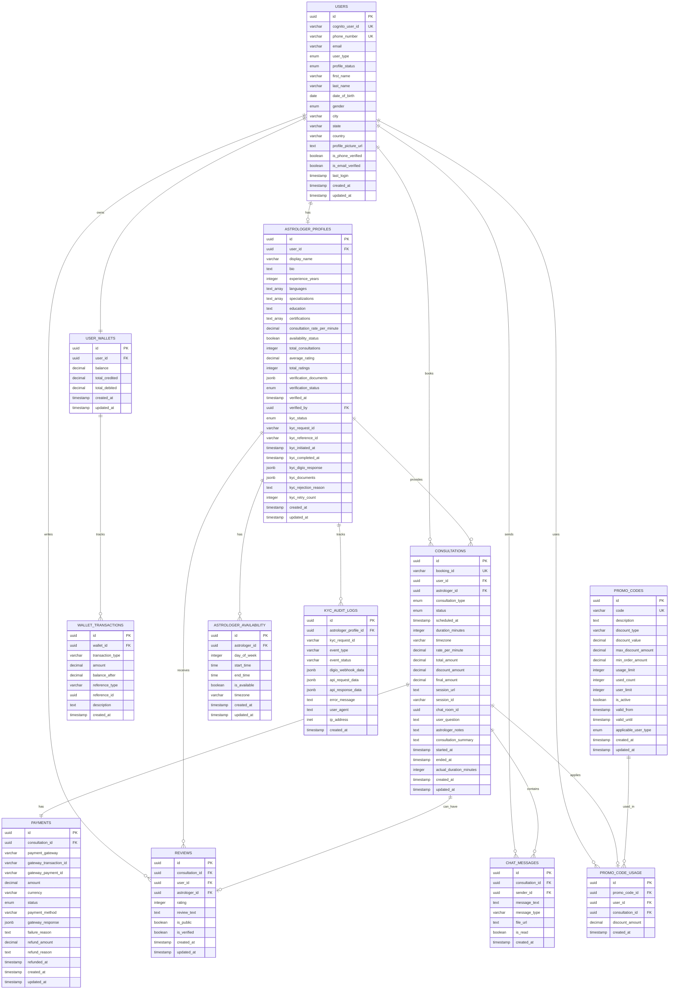

# Data Models and Relationships Documentation

## Entity Relationship Diagram



## Data Model Specifications

### 1. User Management Models

#### Users Model
```typescript
interface User {
  id: string;                    // UUID
  cognito_user_id: string;       // AWS Cognito User ID
  phone_number: string;          // International format (+919876543210)
  email?: string;                // Optional email
  user_type: 'user' | 'astrologer' | 'admin';
  profile_status: 'pending' | 'approved' | 'rejected' | 'suspended';
  first_name: string;
  last_name: string;
  date_of_birth?: Date;
  gender?: 'male' | 'female' | 'other' | 'prefer_not_to_say';
  city?: string;
  state?: string;
  country: string;               // Default: 'India'
  profile_picture_url?: string;
  is_phone_verified: boolean;    // Default: false
  is_email_verified: boolean;    // Default: false
  last_login?: Date;
  created_at: Date;
  updated_at: Date;
}
```

#### AstrologerProfile Model
```typescript
interface AstrologerProfile {
  id: string;                           // UUID
  user_id: string;                      // Foreign key to Users
  display_name: string;                 // Professional name
  bio?: string;                         // Professional biography
  experience_years: number;             // Years of experience
  languages: string[];                  // Languages spoken
  specializations: string[];            // Areas of expertise
  education?: string;                   // Educational background
  certifications: string[];             // Professional certifications
  consultation_rate_per_minute: number; // Rate in INR
  availability_status: boolean;         // Currently available
  total_consultations: number;          // Total consultations completed
  average_rating: number;               // Average rating (0-5)
  total_ratings: number;                // Total number of ratings
  verification_documents: {             // Document verification
    [key: string]: {
      url: string;
      type: string;
      verified: boolean;
    };
  };
  verification_status: 'pending' | 'approved' | 'rejected';
  verified_at?: Date;
  verified_by?: string;                 // Admin user ID
  
  // KYC Integration with Digio
  kyc_status: 'not_started' | 'in_progress' | 'completed' | 'failed' | 'rejected';
  kyc_request_id?: string;              // Digio KYC request ID
  kyc_reference_id?: string;            // Internal reference ID for KYC
  kyc_initiated_at?: Date;              // When KYC was initiated
  kyc_completed_at?: Date;              // When KYC was completed
  kyc_digio_response?: object;          // Complete KYC response from Digio
  kyc_documents?: {                     // Document references from KYC
    pan_card?: KYCDocument;
    aadhaar_card?: KYCDocument;
    video_verification?: VideoKYCResult;
  };
  kyc_rejection_reason?: string;        // Reason for KYC rejection if any
  kyc_retry_count: number;              // Number of KYC retry attempts
  
  created_at: Date;
  updated_at: Date;
}

interface KYCDocument {
  status: 'verified' | 'failed' | 'pending';
  document_number?: string;
  name_on_document?: string;
  verified_at?: Date;
}

interface VideoKYCResult {
  status: 'completed' | 'failed' | 'pending';
  liveness_check?: 'passed' | 'failed';
  verified_at?: Date;
}
```

### 2. Consultation Models

#### Consultation Model
```typescript
interface Consultation {
  id: string;                           // UUID
  booking_id: string;                   // Human-readable ID (AT12345678)
  user_id: string;                      // Customer ID
  astrologer_id: string;                // Astrologer profile ID
  consultation_type: 'call' | 'video' | 'chat' | 'email';
  status: 'scheduled' | 'in_progress' | 'completed' | 'cancelled' | 'no_show';
  
  // Scheduling
  scheduled_at: Date;                   // Appointment time
  duration_minutes: number;             // Planned duration
  timezone: string;                     // Timezone (Asia/Kolkata)
  
  // Pricing
  rate_per_minute: number;              // Rate at booking time
  total_amount: number;                 // Base amount
  discount_amount: number;              // Discount applied
  final_amount: number;                 // Final payable amount
  
  // Session details
  session_url?: string;                 // Video/call session URL
  session_id?: string;                  // Third-party session ID
  chat_room_id?: string;                // Chat room identifier
  
  // Content
  user_question?: string;               // User's question/concern
  astrologer_notes?: string;            // Astrologer's private notes
  consultation_summary?: string;        // Session summary
  
  // Actual timing
  started_at?: Date;                    // Actual start time
  ended_at?: Date;                      // Actual end time
  actual_duration_minutes?: number;     // Actual duration
  
  created_at: Date;
  updated_at: Date;
}
```

#### Payment Model
```typescript
interface Payment {
  id: string;                           // UUID
  consultation_id: string;              // Related consultation
  payment_gateway: string;              // razorpay, stripe, paytm
  gateway_transaction_id?: string;      // Gateway transaction ID
  gateway_payment_id?: string;          // Gateway payment ID
  amount: number;                       // Payment amount
  currency: string;                     // Currency code (INR)
  status: 'pending' | 'completed' | 'failed' | 'refunded';
  payment_method?: string;              // card, upi, netbanking, wallet
  
  // Gateway response
  gateway_response?: object;            // Raw gateway response
  failure_reason?: string;              // Failure description
  
  // Refund details
  refund_amount: number;                // Refunded amount
  refund_reason?: string;               // Refund reason
  refunded_at?: Date;                   // Refund timestamp
  
  created_at: Date;
  updated_at: Date;
}
```

### 3. Rating & Review Models

#### Review Model
```typescript
interface Review {
  id: string;                           // UUID
  consultation_id: string;              // Related consultation
  user_id: string;                      // Reviewer ID
  astrologer_id: string;                // Reviewed astrologer
  rating: number;                       // Rating (1-5)
  review_text?: string;                 // Review content
  is_public: boolean;                   // Publicly visible
  is_verified: boolean;                 // Verified purchase
  created_at: Date;
  updated_at: Date;
}
```

### 4. Wallet & Transaction Models

#### UserWallet Model
```typescript
interface UserWallet {
  id: string;                           // UUID
  user_id: string;                      // Wallet owner
  balance: number;                      // Current balance
  total_credited: number;               // Lifetime credits
  total_debited: number;                // Lifetime debits
  created_at: Date;
  updated_at: Date;
}
```

#### WalletTransaction Model
```typescript
interface WalletTransaction {
  id: string;                           // UUID
  wallet_id: string;                    // Related wallet
  transaction_type: 'credit' | 'debit' | 'refund';
  amount: number;                       // Transaction amount
  balance_after: number;                // Balance after transaction
  reference_type?: string;              // consultation, topup, refund
  reference_id?: string;                // Related entity ID
  description?: string;                 // Transaction description
  created_at: Date;
}
```

### 5. KYC Models

#### KYCAuditLog Model
```typescript
interface KYCAuditLog {
  id: string;                           // UUID
  astrologer_profile_id: string;        // Related astrologer profile
  kyc_request_id?: string;              // Digio KYC request ID
  event_type: string;                   // initiated, completed, failed, webhook_received, etc.
  event_status: 'success' | 'failure' | 'pending';
  digio_webhook_data?: object;          // Raw webhook data from Digio
  api_request_data?: object;            // Request data sent to Digio
  api_response_data?: object;           // Response data from Digio
  error_message?: string;               // Error details if any
  user_agent?: string;                  // User agent for web-based KYC
  ip_address?: string;                  // IP address for security tracking
  created_at: Date;
}
```

### 6. Promotional Models

#### PromoCode Model
```typescript
interface PromoCode {
  id: string;                           // UUID
  code: string;                         // Promo code (WELCOME50)
  description?: string;                 // Code description
  discount_type: 'percentage' | 'fixed';
  discount_value: number;               // Discount value
  max_discount_amount?: number;         // Maximum discount cap
  min_order_amount: number;             // Minimum order requirement
  usage_limit?: number;                 // Total usage limit
  used_count: number;                   // Current usage count
  user_limit: number;                   // Per-user usage limit
  is_active: boolean;                   // Active status
  valid_from: Date;                     // Valid from date
  valid_until?: Date;                   // Expiry date
  applicable_user_type: 'user' | 'astrologer' | 'admin';
  created_at: Date;
  updated_at: Date;
}
```

## Business Logic & Relationships

### 1. User Registration Flow
1. User provides phone number and basic details
2. AWS Cognito creates user with custom attributes
3. OTP sent via SMS
4. Upon OTP verification:
   - User record created in PostgreSQL
   - If astrologer: AstrologerProfile created with kyc_status = 'not_started'
   - UserWallet created for all users
   - Profile status set based on user type
   - For astrologers: KYC verification required before going live

### 2. Consultation Booking Flow
1. User selects astrologer and time slot
2. System checks astrologer availability
3. Price calculation with promo codes
4. Payment processing (wallet/gateway)
5. Consultation record created
6. Booking confirmation sent

### 3. Payment & Wallet Logic
1. **Wallet Operations**:
   - All transactions logged in WalletTransaction
   - Balance updated atomically
   - Refunds credited back to wallet

2. **Payment Priority**:
   - Wallet balance used first
   - Remaining amount charged to payment method
   - Failed payments result in booking cancellation

### 4. Rating & Review System
1. Reviews allowed only after consultation completion
2. Average rating calculated automatically via triggers
3. Public reviews displayed on astrologer profiles
4. Verified reviews weighted higher in calculations

### 5. Astrologer Verification Process
1. Astrologer completes registration with basic documents
2. **KYC Process (Required):**
   - Astrologer initiates KYC via Digio integration
   - Video verification with PAN and Aadhaar cards
   - Real-time identity verification
   - KYC status updated based on Digio response
3. **Auto-Approval on Successful KYC:**
   - Profile status automatically updated to 'approved' on successful KYC
   - Astrologer can immediately start accepting consultations
4. **Optional Admin Review:**
   - Post-approval quality checks for profile content
   - Can suspend profiles that violate content guidelines
   - Focus on service quality rather than identity verification

### 6. KYC Workflow
1. **Initiation**: Astrologer clicks "Complete KYC Verification"
2. **Digio Integration**: System creates KYC request with Digio
3. **User Journey**: Redirect to Digio gateway for video verification
4. **Document Verification**: PAN card, Aadhaar card validation
5. **Webhook Processing**: Real-time status updates via Digio webhooks
6. **Completion**: KYC status updated, notifications sent
7. **Retry Logic**: Up to 3 retry attempts for failed KYC
8. **Audit Trail**: All KYC events logged for compliance

## Data Constraints & Validations

### 1. Business Rules
- Phone numbers must be unique across all users
- Astrologers cannot book consultations with themselves
- **Astrologers must complete KYC verification before accepting consultations**
- Reviews can only be submitted once per consultation
- Wallet balance cannot go negative
- Consultation duration must be positive
- Ratings must be between 1-5
- **Maximum 3 KYC retry attempts per astrologer**
- **KYC verification expires after 7 days if not completed**

### 2. Database Constraints
- Foreign key constraints ensure referential integrity
- Check constraints validate data ranges
- Unique constraints prevent duplicates
- NOT NULL constraints ensure required fields

### 3. Application-Level Validations
- Phone number format validation
- Email format validation
- Date/time validation with timezone handling
- File upload validation (size, type)
- Rate limiting on sensitive operations

## Indexing Strategy

### 1. Primary Indexes
- All primary keys (UUID) are automatically indexed
- Unique constraints create automatic indexes

### 2. Performance Indexes
- `users.cognito_user_id` - Fast AWS Cognito lookup
- `users.phone_number` - Login and duplicate check
- `consultations.scheduled_at` - Booking queries
- `astrologer_profiles.average_rating` - Search ranking
- `astrologer_profiles.kyc_status` - KYC status filtering
- `astrologer_profiles.kyc_request_id` - KYC request lookup
- `kyc_audit_logs.astrologer_profile_id` - KYC audit queries
- `kyc_audit_logs.event_type` - KYC event filtering
- `wallet_transactions.created_at` - Transaction history

### 3. Composite Indexes
- `(astrologer_id, scheduled_at)` - Availability queries
- `(user_id, status, created_at)` - User consultation history
- `(astrologer_id, status, created_at)` - Astrologer bookings
- `(kyc_status, verification_status)` - Astrologer filtering by KYC and verification status
- `(kyc_request_id, event_type, created_at)` - KYC audit trail queries

## Scalability Considerations

### 1. Horizontal Scaling
- Read replicas for consultation browsing
- Separate OLAP database for analytics
- Partitioning large tables by date/region

### 2. Caching Strategy
- Redis for session management
- Application-level caching for astrologer listings
- CDN for profile pictures and static content

### 3. Archive Strategy
- Move completed consultations older than 2 years to archive
- Compress chat messages for storage optimization
- Maintain audit trail for financial transactions
