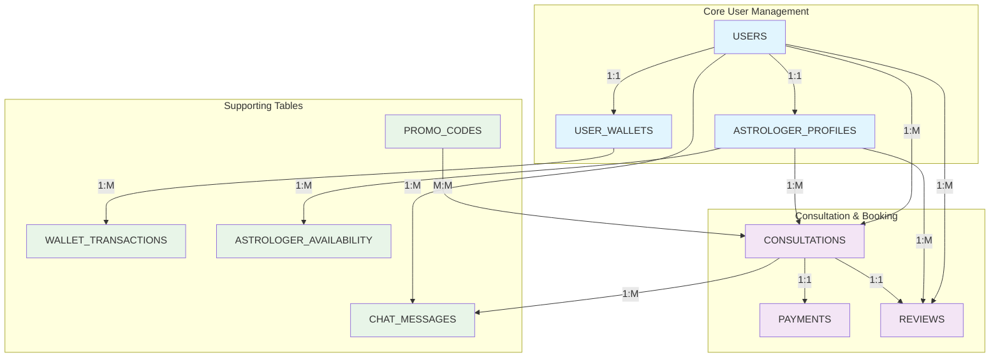

# AstroTalk Database Schema - Simple Diagram

## Database Schema Overview (No Graphviz Required)

## Table Descriptions

### Core Tables

**USERS**
- Primary user authentication and profile
- AWS Cognito integration
- Phone number as primary identifier

**ASTROLOGER_PROFILES**
- Extended profile for astrologers
- Verification and rating system
- Specializations and availability

**CONSULTATIONS**
- Central booking table
- Links users with astrologers
- Multiple consultation types

**PAYMENTS**
- Payment processing
- Multiple gateway support
- Refund handling

### Key Relationships

1. **User → Astrologer**: One-to-one (optional)
2. **User → Consultations**: One-to-many
3. **Astrologer → Consultations**: One-to-many
4. **Consultation → Payment**: One-to-one
5. **User → Wallet**: One-to-one
6. **Wallet → Transactions**: One-to-many

This simplified diagram shows the core structure without requiring complex rendering engines.
